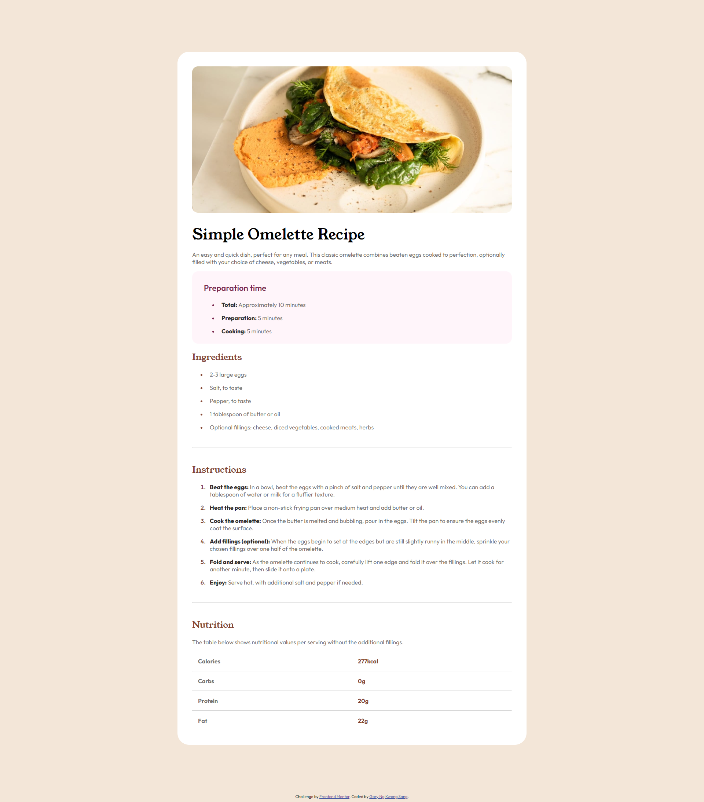

# Frontend Mentor - Recipe page solution

This is a solution to the [Recipe page challenge on Frontend Mentor](https://www.frontendmentor.io/challenges/recipe-page-KiTsR8QQKm).

## Table of contents

- [Overview](#overview)
  - [The challenge](#the-challenge)
  - [Screenshot](#screenshot)
  - [Links](#links)
- [My process](#my-process)
  - [Built with](#built-with)
  - [What I learned](#what-i-learned)
- [Author](#author)

## Overview

### Screenshot

### Links

- Solution URL: [Add solution URL here](https://your-solution-url.com)
- Live Site URL: [https://garynks.github.io/fm-recipe-page/](https://garynks.github.io/fm-recipe-page)

## My process

### Built with

- Semantic HTML5 markup
- CSS
- Flexbox

### What I learned
* How to control the space between a bullet point and text for an `<li>` element
* How to change the color of the bullet point of an `<li>` element
* How to use the `@font-face` CSS rule

## Author

- Website - [Gary Ng Kwong Sang](https://garynks.github.io/)
- Frontend Mentor - [@garynks](https://www.frontendmentor.io/profile/garynks)
- LinkedIn - [https://www.linkedin.com/in/garynks/](https://www.linkedin.com/in/garynks/)
